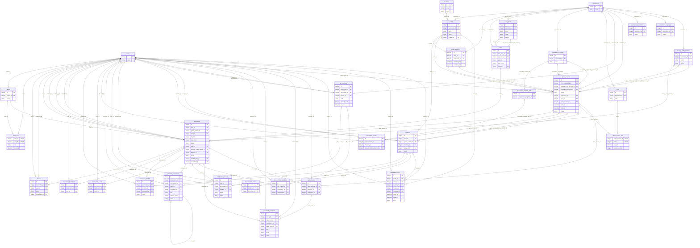

# Modelo E-R completo de Mythos

El detalle de columnas está en el [diccionario](../diccionario-datos.md). Los nodos externos al bloque permiten ver los vínculos con otras áreas.

```mermaid
erDiagram
    users o|--o{ availability_blocks : released_by
    users o|--o{ availability_blocks : created_by
    incidents o|--o{ availability_blocks : incident_id
    users o|--o{ availability_blocks : user_id
    rooms o|--o{ availability_blocks : room_id
    experiences ||--o{ booking_policy_versions : experience_id
    experiences ||--o{ experience_languages : experience_id
    experiences ||--o{ experience_translations : experience_id
    reservations o|--o{ game_results : reservation_id
    users ||--o{ game_results : recorded_by
    game_sessions ||--o| game_results : game_session_id
    hints ||--o{ game_session_hint : hint_id
    game_sessions ||--o{ game_session_hint : game_session_id
    preparation_templates o|--o{ game_sessions : preparation_template_id_experience_id
    booking_policy_versions o|--o{ game_sessions : booking_policy_version_id_experience_id
    room_experience ||--o{ game_sessions : room_experience_id_room_id_experience_id
    users ||--o{ game_sessions : game_master_id
    rooms ||--o{ game_sessions : room_id
    experiences ||--o{ game_sessions : experience_id
    preparation_templates o|--o{ game_sessions : preparation_template_id
    booking_policy_versions o|--o{ game_sessions : booking_policy_version_id
    room_experience ||--o{ game_sessions : room_experience_id
    game_results o|--o{ generated_documents : game_result_id
    reservations o|--o{ generated_documents : reservation_id
    users ||--o{ generated_documents : requested_by
    users o|--o{ generated_documents : owner_id
    users ||--o{ gift_voucher_redemptions : redeemed_by
    reservations ||--o{ gift_voucher_redemptions : reservation_id
    gift_vouchers ||--o| gift_voucher_redemptions : gift_voucher_id
    users o|--o{ gift_vouchers : issued_by
    users o|--o{ gift_vouchers : purchased_by
    experiences o|--o{ gift_vouchers : experience_id
    experiences ||--o{ hints : experience_id
    game_sessions o|--o{ incidents : game_session_id_room_id
    users o|--o{ incidents : assigned_to
    users ||--o{ incidents : reported_by
    game_sessions o|--o{ incidents : game_session_id
    rooms ||--o{ incidents : room_id
    users ||--o{ maintenance_actions : technician_id
    incidents ||--o{ maintenance_actions : incident_id
    incidents o|--o{ notification_deliveries : incident_id
    reservations o|--o{ notification_deliveries : reservation_id
    users o|--o{ notification_deliveries : user_id
    users ||--o{ payment_transactions : recorded_by
    payment_transactions o|--o{ payment_transactions : parent_id
    gift_vouchers o|--o{ payment_transactions : gift_voucher_id
    reservations o|--o{ payment_transactions : reservation_id
    preparation_template_items o|--o{ preparation_checks : preparation_template_item_id
    users o|--o{ preparation_checks : checked_by
    game_sessions ||--o{ preparation_checks : game_session_id
    preparation_templates ||--o{ preparation_template_items : preparation_template_id
    experiences ||--o{ preparation_templates : experience_id
    experiences ||--o{ rate_plans : experience_id
    rate_plans ||--o{ rates : rate_plan_id_experience_id_currency
    experiences ||--o{ rates : experience_id
    rate_plans ||--o{ rates : rate_plan_id
    users o|--o{ reservation_events : actor_id
    reservations ||--o{ reservation_events : reservation_id
    users o|--o{ reservation_incident : reviewed_by
    incidents ||--o{ reservation_incident : incident_id
    reservations ||--o{ reservation_incident : reservation_id
    users o|--o{ reservation_participants : user_id
    reservations ||--o{ reservation_participants : reservation_id
    users o|--o{ reservations : cancelled_by
    users o|--o{ reservations : checked_in_by
    users o|--o{ reservations : booked_by
    booking_policy_versions o|--o{ reservations : booking_policy_version_id
    rates o|--o{ reservations : rate_id
    teams o|--o{ reservations : team_id
    game_sessions ||--o{ reservations : game_session_id
    users ||--o{ reservations : user_id
    users o|--o{ reviews : moderated_by
    users ||--o{ reviews : user_id
    reservations ||--o| reviews : reservation_id
    experiences ||--o{ room_experience : experience_id
    rooms ||--o{ room_experience : room_id
    locations o|--o{ rooms : location_id
    experiences ||--o{ rooms : experience_id
    users ||--o{ team_user : user_id
    teams ||--o{ team_user : team_id
    users ||--o{ teams : owner_id

    availability_blocks {
        integer id PK
        integer room_id FK
        integer user_id FK
        integer incident_id FK
        integer created_by FK
        integer released_by FK
        datetime starts_at
        datetime ends_at
        string kind
    }

    booking_policy_versions {
        integer id PK
        integer experience_id FK
        string name
        string status
    }

    experience_languages {
        integer id PK
        integer experience_id FK
        string locale
    }

    experience_translations {
        integer id PK
        integer experience_id FK
        string locale
    }

    experiences {
        integer id PK
        string name
    }

    game_results {
        integer id PK
        integer game_session_id FK
        integer recorded_by FK
        integer reservation_id FK
    }

    game_session_hint {
        integer game_session_id PK,FK
        integer hint_id PK,FK
        datetime used_at
        integer penalty_seconds
    }

    game_sessions {
        integer id PK
        integer room_experience_id FK
        integer booking_policy_version_id FK
        integer preparation_template_id FK
        string locale
        integer experience_id FK
        integer room_id FK
        integer game_master_id FK
        datetime starts_at
        datetime ends_at
        string status
    }

    generated_documents {
        integer id PK
        integer owner_id FK
        integer requested_by FK
        integer reservation_id FK
        integer game_result_id FK
        string kind
        string locale
        string status
    }

    gift_voucher_redemptions {
        integer id PK
        integer gift_voucher_id FK
        integer reservation_id FK
        integer redeemed_by FK
    }

    gift_vouchers {
        integer id PK
        integer experience_id FK
        integer purchased_by FK
        integer issued_by FK
        string kind
        integer amount_cents
        integer players
    }

    hints {
        integer id PK
        integer experience_id FK
        string code
    }

    incidents {
        integer id PK
        integer room_id FK
        integer game_session_id FK
        integer reported_by FK
        integer assigned_to FK
        string status
    }

    locations {
        integer id PK
        string name
        string code
    }

    maintenance_actions {
        integer id PK
        integer incident_id FK
        integer technician_id FK
    }

    notification_deliveries {
        integer id PK
        integer user_id FK
        integer reservation_id FK
        integer incident_id FK
        string locale
        string status
    }

    payment_transactions {
        integer id PK
        integer reservation_id FK
        integer gift_voucher_id FK
        integer parent_id FK
        integer recorded_by FK
        string kind
        integer amount_cents
        string status
    }

    preparation_checks {
        integer id PK
        integer game_session_id FK
        integer checked_by FK
        integer preparation_template_item_id FK
    }

    preparation_template_items {
        integer id PK
        integer preparation_template_id FK
    }

    preparation_templates {
        integer id PK
        integer experience_id FK
        string name
    }

    rate_plans {
        integer id PK
        integer experience_id FK
        string code
        string name
        string status
    }

    rates {
        integer id PK
        integer rate_plan_id FK
        integer experience_id FK
        integer players
        integer total_cents
        string currency FK
    }

    reservation_events {
        integer id PK
        integer reservation_id FK
        integer actor_id FK
    }

    reservation_incident {
        integer id PK
        integer reservation_id FK
        integer incident_id FK
        integer reviewed_by FK
        string status
    }

    reservation_participants {
        integer id PK
        integer reservation_id FK
        integer user_id FK
    }

    reservations {
        integer id PK
        integer user_id FK
        integer game_session_id FK
        integer team_id FK
        integer players
        integer total_cents
        string status
        integer rate_id FK
        integer booking_policy_version_id FK
        integer booked_by FK
        string locale
        integer checked_in_by FK
        integer cancelled_by FK
    }

    reviews {
        integer id PK
        integer reservation_id FK
        integer user_id FK
        string status
        integer moderated_by FK
    }

    room_experience {
        integer id PK
        integer room_id FK
        integer experience_id FK
        datetime installed_from
        datetime installed_until
    }

    rooms {
        integer id PK
        integer experience_id FK
        string name
        string status
        integer location_id FK
    }

    team_user {
        integer team_id PK,FK
        integer user_id PK,FK
        string role
        datetime joined_at
    }

    teams {
        integer id PK
        integer owner_id FK
        string name
    }

    users {
        integer id PK
        string name
    }
```
