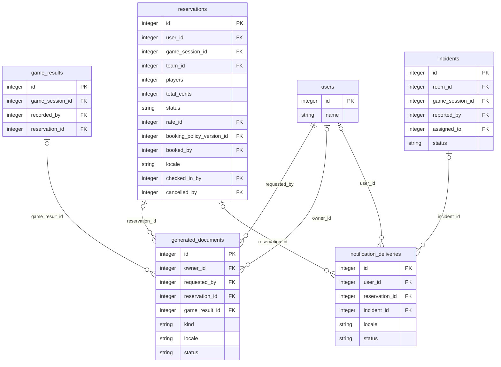

# Avisos y documentos

El detalle de columnas está en el [diccionario](../diccionario-datos.md). Los nodos externos al bloque permiten ver los vínculos con otras áreas.

```mermaid
erDiagram
    game_results o|--o{ generated_documents : game_result_id
    reservations o|--o{ generated_documents : reservation_id
    users ||--o{ generated_documents : requested_by
    users o|--o{ generated_documents : owner_id
    incidents o|--o{ notification_deliveries : incident_id
    reservations o|--o{ notification_deliveries : reservation_id
    users o|--o{ notification_deliveries : user_id

    game_results {
        integer id PK
        integer game_session_id FK
        integer recorded_by FK
        integer reservation_id FK
    }

    generated_documents {
        integer id PK
        integer owner_id FK
        integer requested_by FK
        integer reservation_id FK
        integer game_result_id FK
        string kind
        string locale
        string status
    }

    incidents {
        integer id PK
        integer room_id FK
        integer game_session_id FK
        integer reported_by FK
        integer assigned_to FK
        string status
    }

    notification_deliveries {
        integer id PK
        integer user_id FK
        integer reservation_id FK
        integer incident_id FK
        string locale
        string status
    }

    reservations {
        integer id PK
        integer user_id FK
        integer game_session_id FK
        integer team_id FK
        integer players
        integer total_cents
        string status
        integer rate_id FK
        integer booking_policy_version_id FK
        integer booked_by FK
        string locale
        integer checked_in_by FK
        integer cancelled_by FK
    }

    users {
        integer id PK
        string name
    }
```
